# wuapi Inbox

<p align="center">
  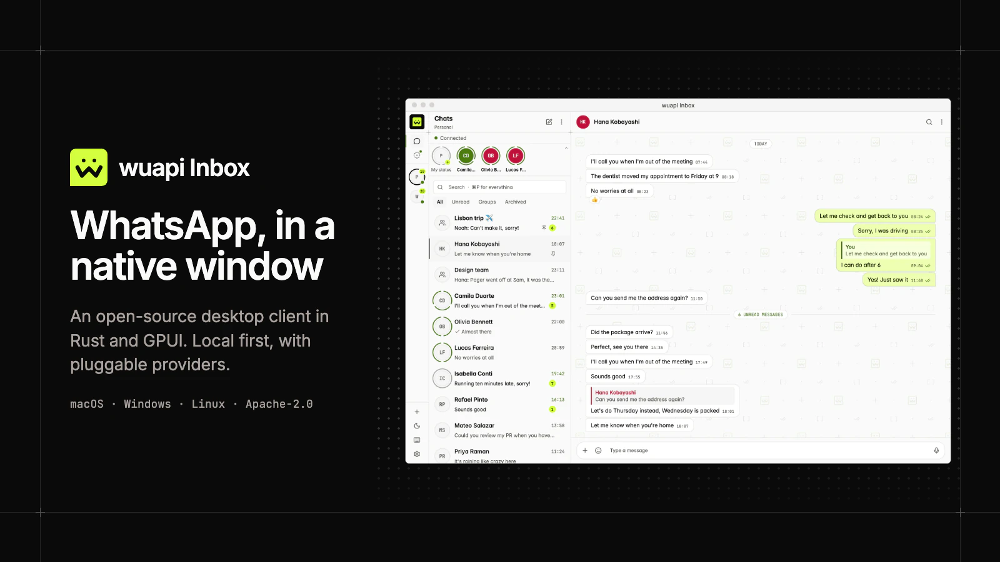
</p>

An open-source, native desktop WhatsApp client for macOS, Windows and Linux. It starts in 0.57 s, opens a chat in 13 ms and holds 120 MB of memory with a conversation open.

## Fast and light

| Measured | Median |
|---|---|
| Start: from the process being launched to the chat list drawn | 0.57 s |
| Open a chat: from the click to the conversation's frame painted | 13 ms |
| Search: from a keystroke to the results' frame painted | 8 ms |
| One frame while scrolling a conversation | 3.8 ms |
| Memory with a conversation open (what Activity Monitor calls Memory) | 120 MB |
| Processor, left alone for a minute | 0.08 % of one core |
| Download, macOS on Apple Silicon (`.dmg`, 0.1.0) | 22.5 MB |

Measured on 2026-10-04 on a MacBook Pro (M1 Pro, 16 GB, macOS 26.6.2), release build, on the built-in demo data. The three frame times are the application's own work, from the input event to the frame laid out and painted; the display shows it at its next refresh. [How we measured](docs/media/measurements.md) has the ranges, the method, what the figures leave out, and the script that takes them again on your machine: `docs/media/measure.sh`.

Why: the window is native and drawn on the GPU by [GPUI](https://gpui.rs), with no browser engine inside; it reads a local SQLite database (encrypted with SQLCipher) and never waits for the network; and it is one process.

The demo history is small, so the local store was also timed over 100,000 messages: the query that opens a chat takes 0.9 ms, and a search takes 0.6 ms for a rare word and 82 ms for the most common one.

## See it

Four clips of the application on the demo data, at the speed they were recorded. The application saved its own frames, 20 a second; on a screen it draws at the display's rate. Each picture links to the MP4.

<table>
  <tr>
    <td width="50%"><a href="docs/media/clip-start.mp4"></a><br>Start. The timer runs from the launch of the process to the chat list drawn: 0.62 s in this recording.</td>
    <td width="50%"><a href="docs/media/clip-chats.mp4">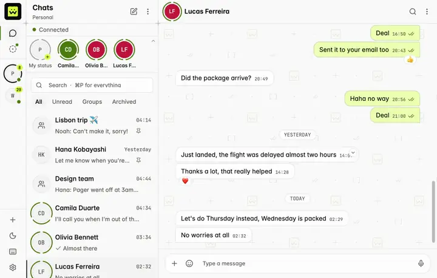</a><br>Five chats opened one after the other, then a group scrolled back and down again.</td>
  </tr>
  <tr>
    <td width="50%"><a href="docs/media/clip-search.mp4">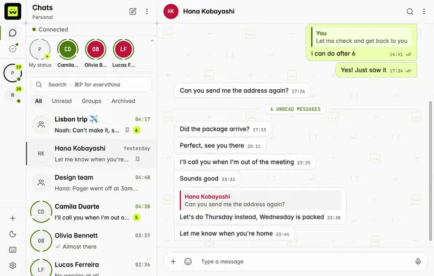</a><br>Search over the message history, with results after every letter.</td>
    <td width="50%"><a href="docs/media/clip-palette.mp4">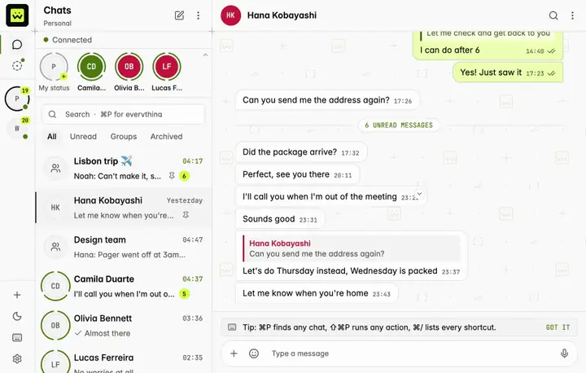</a><br>The command palette (⌘P) and the light and dark themes.</td>
  </tr>
</table>

<p align="center">
  <picture><source media="(prefers-color-scheme: dark)" srcset="docs/media/screenshot-chats-dark.webp">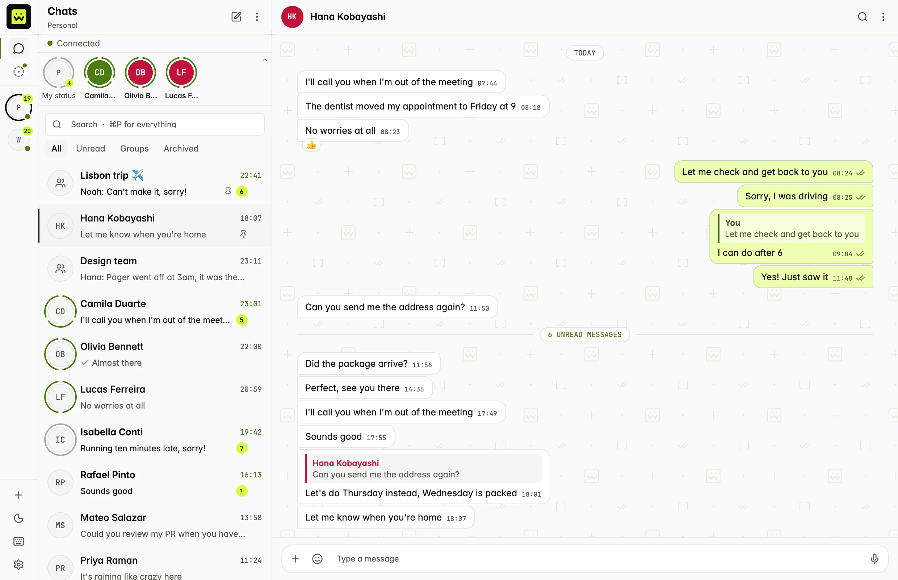</picture> <picture><source media="(prefers-color-scheme: dark)" srcset="docs/media/screenshot-group-dark.webp">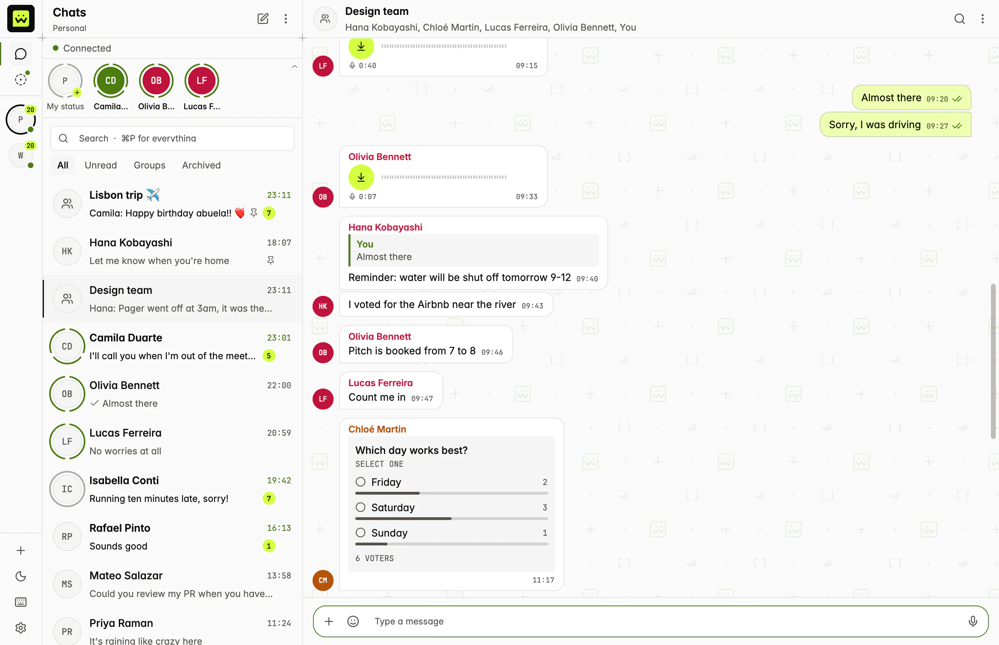</picture> <picture><source media="(prefers-color-scheme: dark)" srcset="docs/media/screenshot-palette-dark.webp">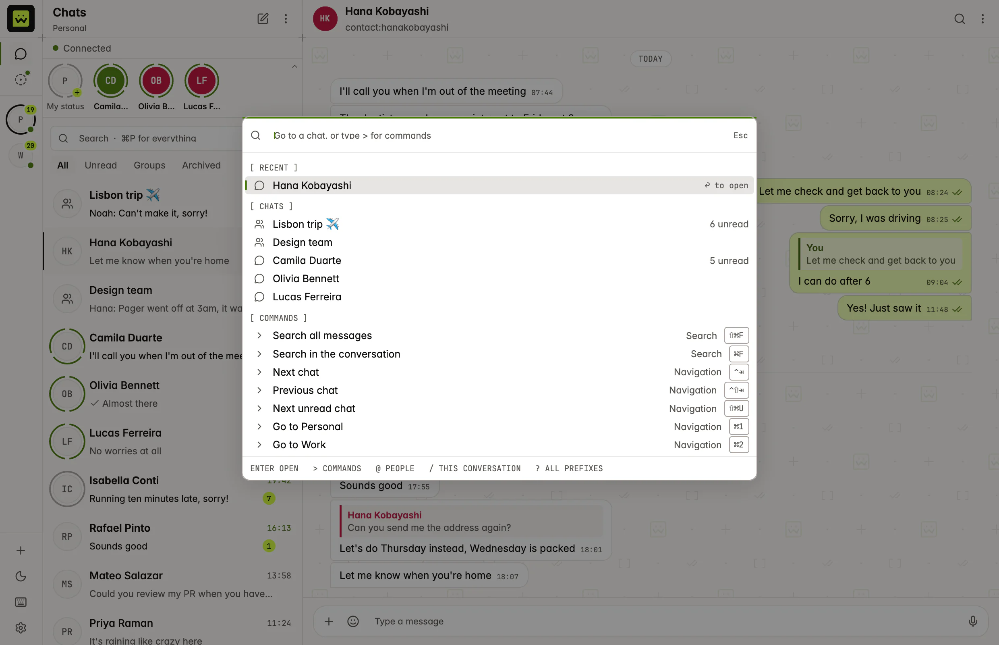</picture>
</p>
<p align="center">
  <picture><source media="(prefers-color-scheme: dark)" srcset="docs/media/screenshot-media-dark.webp">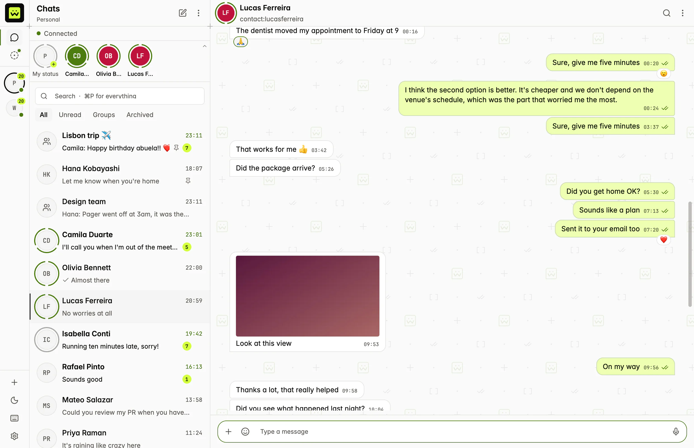</picture> <picture><source media="(prefers-color-scheme: dark)" srcset="docs/media/screenshot-status-dark.webp">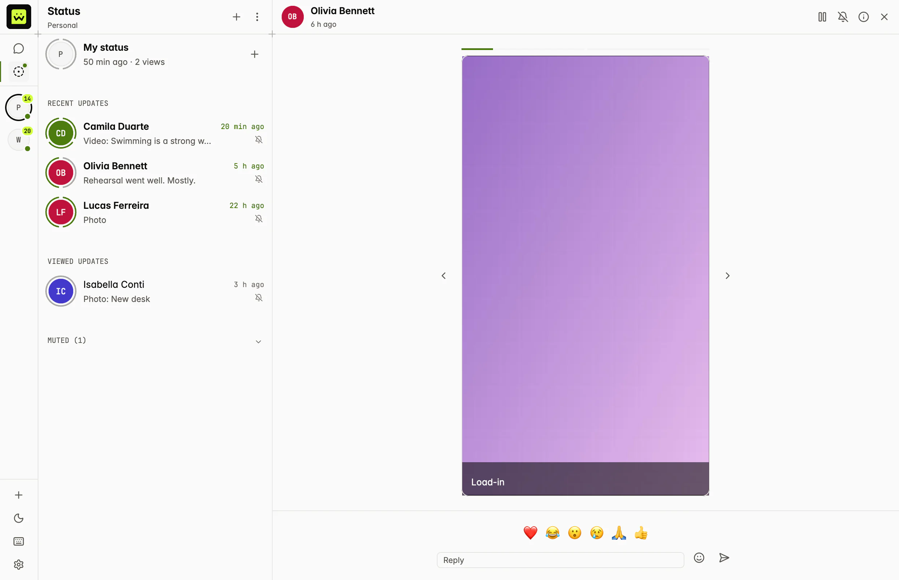</picture> <picture><source media="(prefers-color-scheme: dark)" srcset="docs/media/screenshot-settings-dark.webp">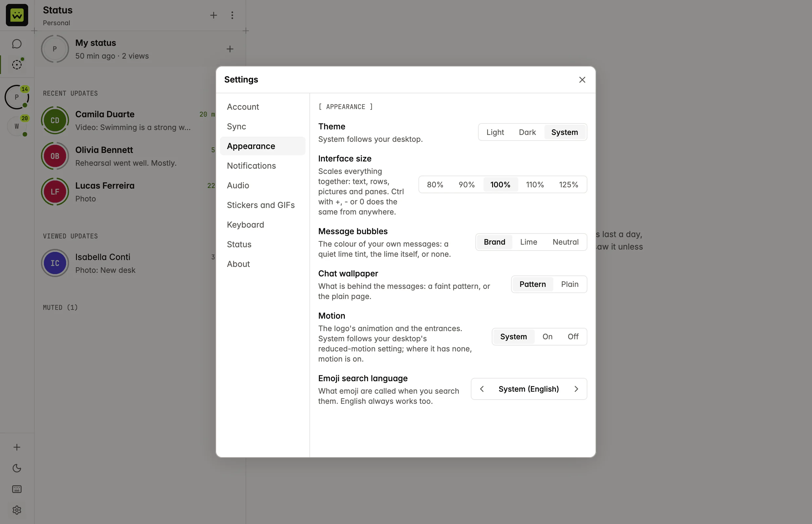</picture>
</p>

The screenshots follow your theme and show the built-in demo data: nobody in them exists.

## How it works

<p align="center">
  <a href="docs/media/wuapi-inbox.mp4">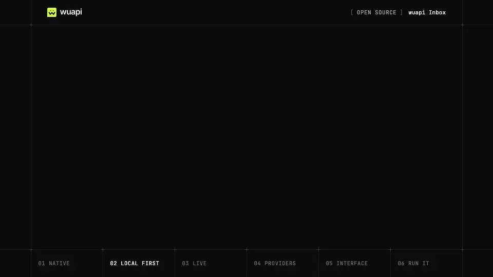</a>
</p>

[Watch the video](docs/media/wuapi-inbox.mp4) (42 seconds, no sound).

It is written in Rust, with the UI in [GPUI](https://gpui.rs), the framework behind the Zed editor. It is local-first: the window only reads from a database on your computer, and a background engine keeps that database in sync. Opening a chat, scrolling back and searching are local queries.

## Bring your own backend

How the client reaches WhatsApp is pluggable. A *provider* is an adapter around one backend: a hosted API, a self-hosted gateway, a protocol library. It is one trait, `Provider`, in [`crates/client-provider`](crates/client-provider). The reference adapter is for [wuapi](https://wuapi.dev). A provider only translates: storage, search, retries, the outbox and the window are the client's, and the window never calls a provider.

1. **Create a crate** that depends on `client-provider`, `async-trait` and `futures`. [`crates/provider-example`](crates/provider-example) is one file to copy.
2. **Implement the nine required methods**: `id`, `capabilities`, `list_accounts`, `list_chats`, `fetch_messages`, `send`, `mark_read`, `download_media` and `subscribe`. The other 60 are optional and have defaults.
3. **Declare capabilities.** What a backend can do beyond that is said with the flags of `Capabilities`, and an optional method is only called when its flag is on; the window hides what a flag does not turn on (no reaction picker without `reactions`, no attach button without `media_upload`).
4. **Register it.** Providers are compiled in, not loaded at runtime: add a variant to `ProviderKind` and its name to `--provider` in [`crates/app/src/cli.rs`](crates/app/src/cli.rs), and construct it in [`crates/app/src/providers.rs`](crates/app/src/providers.rs). The example's lines are the ones marked `provider-example`.
5. **Test it.** Copy [`crates/provider-example/tests/contract.rs`](crates/provider-example/tests/contract.rs): the account and chat listings, a send repeated, history paged newest first, a refusal that is not retried, an event pushed.

The smallest provider that compiles, for a backend with nothing in it (a doc-test of `provider-example`, so it is built with the workspace):

```rust
use async_trait::async_trait;
use client_provider::*;
use futures::StreamExt as _;

pub struct Minimal;

#[async_trait]
impl Provider for Minimal {
    fn id(&self) -> &'static str {
        "minimal"
    }
    // What the backend can do. The UI hides the rest.
    fn capabilities(&self) -> Capabilities {
        Capabilities { chat_list: true, replies: true, ..Capabilities::none() }
    }
    async fn list_accounts(&self) -> ProviderResult<Vec<Account>> {
        Ok(Vec::new())
    }
    async fn list_chats(&self, _: &AccountId, _: Option<Cursor>) -> ProviderResult<Page<Chat>> {
        Ok(Page::last(Vec::new()))
    }
    async fn fetch_messages(
        &self, _: &AccountId, _: &ChatId, _: Option<Cursor>, _limit: u32,
    ) -> ProviderResult<Page<Message>> {
        Ok(Page::last(Vec::new())) // newest first
    }
    // The same client_id must always answer the same message id.
    async fn send(&self, message: OutgoingMessage) -> ProviderResult<SendReceipt> {
        let message_id = MessageId::new(message.client_id.as_str());
        Ok(SendReceipt { message_id, status: DeliveryStatus::Sent, timestamp: None })
    }
    async fn mark_read(&self, _: &AccountId, _: &ChatId, _: Option<&MessageId>) -> ProviderResult<()> {
        Ok(())
    }
    async fn download_media(&self, _: &AccountId, _: &MediaRef) -> ProviderResult<MediaData> {
        Err(ProviderError::Unsupported("media"))
    }
    // Live updates: a stream of events, pushed or polled for.
    async fn subscribe(&self) -> ProviderResult<EventStream> {
        Ok(futures::stream::pending().boxed())
    }
}
```

<p align="center">
  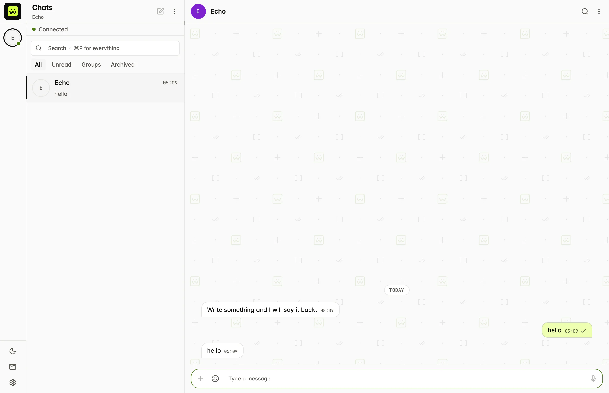
</p>

That is the example provider in the window: an in-memory backend that says back what it is sent.

```sh
cargo run -p wuapi-inbox --features provider-example -- --provider example
```

**Live updates** are the stream `subscribe` returns: `ProviderEvent`s such as a message upserted, a status moved, a chat changed. How they get there is the provider's business: pushed by the backend, asked for at an interval inside the provider, or both. The wuapi adapter keeps its transports behind a small trait of its own, `EventSource`: wuapi Streams (server-sent events) when the API has it, polling when it does not, and a slow safety poll beside the stream. Events are hints, applied idempotently: one delivered twice or missed does no harm, because the client reads the history again after a gap.

Two rules matter more than the rest: a `send` repeated with the same `client_id` puts one message on WhatsApp and answers the same id, and an error says whether to retry (`Transient`, `RateLimited`) or not (`Rejected`, `Unauthorized`). [docs/PROVIDERS.md](docs/PROVIDERS.md) is the full guide: a walkthrough, every method with the flag that gates it, the model, errors, tests and a checklist for a pull request.

## Download

Builds are on the [releases page](https://github.com/wuapidev/wuapi-inbox/releases). Pick the file for your computer (`<version>` is the release, for example `0.1.0`):

| Platform | File | To install |
|---|---|---|
| macOS, Apple Silicon | `wuapi-inbox-<version>-macos-aarch64.dmg` | Open it and drag the application to Applications. |
| macOS, Intel | `wuapi-inbox-<version>-macos-x86_64.dmg` | The same. |
| Windows, x86_64 | `wuapi-inbox-<version>-windows-x86_64.zip` | There is no installer: unzip it and put the `.exe` in a folder you own. |
| Linux, x86_64 | `wuapi-inbox-<version>-linux-x86_64.AppImage` | Make it executable and run it. It needs FUSE 2 (`libfuse2` on Debian and Ubuntu); without it, run it with `--appimage-extract-and-run`. |
| Linux, x86_64 (archive) | `wuapi-inbox-<version>-linux-x86_64.tar.gz` | Unpack it: the binary, a desktop entry, the icon and the licence. The updater uses this one. |

The macOS builds are signed and notarized. The Windows build is not code-signed yet, so Windows warns about an unknown publisher before it runs. `SHA256SUMS` in the release lists the checksum of every file. An installed copy looks for new versions and updates itself; the `.tar.gz` files for macOS and Windows are what the updater downloads. [docs/RELEASING.md](docs/RELEASING.md) has the details.

On Linux the release also carries `install.sh`, which unpacks the app under `~/.local`, adds it to the applications menu and leaves the self-updater working:

```sh
curl -fsSL https://github.com/wuapidev/wuapi-inbox/releases/latest/download/install.sh | sh
```

The `.deb` and `.rpm` are for the system's package manager instead: they install under `/usr`, where the package manager owns the files and the app only says a new version is out. The Linux build needs glibc 2.35 or later (Debian 12, Ubuntu 22.04, Fedora 35, RHEL 9 and later).

## Status

Early: 0.1.0 is the first release, with builds for macOS, Windows and Linux.

Working today, on the built-in demo provider:

- several accounts, chat list with search and filters, 1:1 and group conversations;
- text messages, replies, reactions, delivery and read ticks, typing indicators;
- sending through a persistent outbox that survives restarts and never sends twice;
- full-text search over message history;
- light and dark themes;
- pin, mute, archive and mark as unread; starting a chat with a number; search inside a conversation;
- a settings panel (account, appearance, notification preferences, about);
- an encrypted local database (SQLCipher), with its key in the OS keychain;
- profile pictures, images and stickers inline, voice notes and audio played in place, and other attachments opened with the system's application;
- Status (stories): a Status button in the rail beside Chats, a strip of who has something new above the chats, the list of updates with a ring around each person who has one, a viewer with progress, pause, replies and reactions, posting a text, a picture or a video, who saw your status, who sees it, and muting. With wuapi (SDK 0.12.0), posting, your own status with who saw it, contacts' updates, view receipts, replies and reactions go through the API; contacts' updates reach a number once stories are turned on for it. Muting a contact's status stays on this computer and the audience is read-only: the API cannot write either yet. Where the backend does not have a part yet, that part says "not available yet" and the rest works.

Files can be attached (the "+" button, a drop on the conversation, or a paste of a picture or of copied files); with wuapi that waits for the upload routes to be deployed, and says "not available yet" until then. Not there yet: desktop notifications are not delivered (the preference is saved), and voice-note recording is shown as unavailable. The wuapi adapter is tested against a mock of the API, and has been run against the live service with live updates over Streams (on 2026-10-03).

## Run it

You need a recent stable Rust (the repository pins the toolchain in `rust-toolchain.toml`). On Linux you also need the development packages for Wayland or X11, xkbcommon and Vulkan.

```sh
cargo run -p wuapi-inbox                    # wuapi: sign in, then your chats
cargo run -p wuapi-inbox -- --theme dark
cargo run -p wuapi-inbox -- --provider mock   # demo data, nothing leaves your machine
cargo run -p wuapi-inbox -- --welcome         # the welcome screen first
cargo run -p wuapi-inbox -- --live stream     # wuapi Streams only: no polling (auto and polling are the others)
```

With wuapi, the default, the first start shows a welcome and then a sign-in screen: you get a short code and approve it in the browser. The API key it receives is kept in your operating system's keychain, and so is the key of the local database. `--no-keychain` uses neither (you sign in at every start and nothing is saved to disk). Signing out deletes the key and the chats stored on the computer. Live updates come over wuapi Streams when the API has them and by polling when it does not (`--live auto`, the default); `--live stream` insists on the stream, `--live polling` never uses it, and `--stream-url` points the stream at another address. `--help` lists the other options.

Building needs `perl` and `make` as well (for the vendored OpenSSL that encrypts the database), and on Linux the ALSA development headers for audio (`alsa-lib` on Arch, `libasound2-dev` on Debian and Ubuntu).

## Layout

| Crate | What it is |
|---|---|
| [`crates/client-provider`](crates/client-provider) | The provider trait and the neutral model it speaks. The public extension point. |
| [`crates/client-core`](crates/client-core) | The local SQLite store, the outbox and the sync engine. |
| [`crates/provider-mock`](crates/provider-mock) | An in-memory provider with seeded data and fake live events, for development and tests. |
| [`crates/provider-wuapi`](crates/provider-wuapi) | The reference adapter, for wuapi. |
| [`crates/provider-example`](crates/provider-example) | The worked example of the provider guide: an in-memory backend that says back what it is sent. Not in a release build. |
| [`crates/brand-mark`](crates/brand-mark) | The animated wuapi mark, as a GPUI element. |
| [`crates/app`](crates/app) | The GPUI application. |
| [`crates/updater`](crates/updater) | Self-update: a signed manifest, a resumable download, an install that is undone if the new version does not start. |
| [`crates/xtask`](crates/xtask) | Release tooling (`cargo xtask`): the signing key, the packages, the manifest. |

[docs/ARCHITECTURE.md](docs/ARCHITECTURE.md) explains how they fit together, and [docs/RELEASING.md](docs/RELEASING.md) how a release is made and how installed copies update themselves.

## Development

```sh
cargo build --workspace
cargo test --workspace
cargo clippy --workspace --all-targets
```

### Screenshots, clips and measurements

Everything in `docs/media` is made by the application drawing its own window, on the demo data, with no keychain and a scratch data directory. Nothing else on the screen can be in a frame and no screen-recording permission is involved. This is a development aid behind the `capture` cargo feature (`crates/app/src/capture.rs`); it is not in a default or a release build.

```sh
docs/media/capture.sh    # PNG frames of each screen, in target/capture/raw
docs/media/process.sh    # turns them into docs/media/screenshot-*.webp (needs cwebp)
docs/media/clips.sh      # records docs/media/clip-*.mp4 and their previews (needs ffmpeg, img2webp)
docs/media/measure.sh    # takes the measurements of docs/media/measurements.md again
```

The scripts that drive the window are `docs/media/capture/*.txt`, one step per line. Look at the frames before keeping them (`clips.sh` leaves a sheet of each clip in `target/clips`): the demo world follows the clock and plays live messages, so the fixed clicks and scroll distances of a script can land differently from one run to the next, and a frame may need another take. The hero image, the 42-second video, its poster and its preview loop are rendered from the screenshots by a separate Remotion project.

## Licence

[Apache-2.0](LICENSE).

This project is not affiliated with, endorsed by or connected to WhatsApp.
